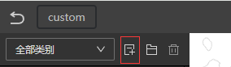
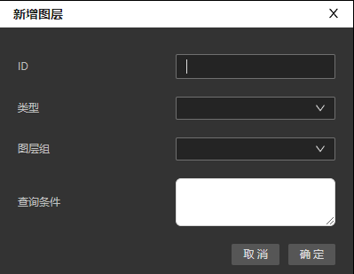

# 添加图层

Designer 提供了多种方式来添加图层。

> [!TIP]
> 如果您需要为图层分组，可以先创建好图层组，方便新建图层时选择其所属的图层组

## 通过图层面板选取添加

您可以点选右上角的图层按钮，来打开图层面板。

因为每个级别的矢量瓦片包含的图层可能不同，所以图层面板中会按级别，列出从瓦片数据中解析的图层以及每个图层的属性名。

您只需要点击图层名前面的`+`，Designer 就会弹出新增图层面板，并自动生成图层的查询条件。

> [!NOTE]
> 图层面板中自动生成的查询条件会自动包含 `$layer` 和 `$type` 条件。

## 自定义添加

您也可以通过自定义添加方式添加新图层。

- 点击左上角的添加图层按钮
  
- 在新建图层的面板中填入图层 id，选择类型，所属图层组（选填），图层的查询条件（选填）后，点击确定即可。
  
