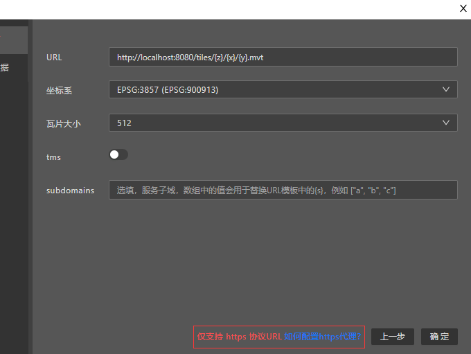

# 自定义数据源

自定义数据源向导提供了连接矢量瓦片服务所需的必要参数，其界面如下：


## 配置说明

* **URL**， URL模板，对应maptalks引擎VectorTileLayer类中```urlTemplate```配置，例如 `https://localhost/tiles/{z}/{x}/{y}.pbf`
* **坐标系**，数据源的坐标系
* **瓦片大小**，矢量瓦片的瓦片大小，单位像素，512是标准矢量瓦片服务的默认尺寸，也可以根据实际情况选择其他尺寸
* **tms**，瓦片的组织方式是否是tms，各类遵从OGC标准的GIS数据服务常用，例如 GeoServer
* **subdomains**，选填项，当瓦片服务由多个服务地址提供时，subdomains用于设置服务子域，数组中的值用于替换URL模板中的 `{s}` 变量，例如 `["0", "1", "2"]`

## 如何访问http协议的数据？

因为Designer是https协议服务，浏览器不允许其直接访问http协议数据，当您的数据源为http协议，Designer创建设计时会出现以下报错：


您可以参考[HTTPS反向代理](https)配置HTTPS反向代理。

## 如何跨域？

如果您的数据服务不允许跨域访问，您同样可以参考[HTTPS反向代理](https)配置本地的反向代理，教程中建立的代理会自动添加CORS响应头允许跨域访问。

## 矢量瓦片支持哪些投影坐标系？

矢量瓦片目前支持两种投影坐标系，`EPSG:3857`（别名`EPSG:900913`） 和 `EPSG:4326`（`EPSG:4490`投影与`EPSG:4326`基本相同）

> [!NOTE]
> * `EPSG:3857`是最受互联网地图欢迎的坐标系，采用墨卡托投影，原始的3857投影256的瓦片大小，mapbox综合考量后[采用512作为瓦片大小](https://blog.mapbox.com/512-map-tiles-cb5bfd6e72ba)
> * `EPSG:4326` 直接采用经纬度作为投影坐标，在GeoServer提供的数据服务中较常见。

## tms是什么？

TMS全称是`Tile Map Service`，是一种[OGC制定的瓦片组织标准](https://en.wikipedia.org/wiki/Tile_Map_Service)，它与常见的XYZ瓦片组织方式最大的不同是，TMS瓦片的编号在Y轴方向与XYZ瓦片方向相反，往北的瓦片编号依次增大。

TMS瓦片常见于遵从OGC标准的GIS数据服务软件，例如GeoServer


