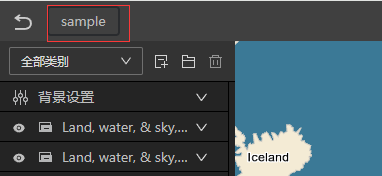

# 导出样式并调用

点击右上方工具栏中的导出按钮，就能导出样式。


点击按钮后，先选择您要导出的文件夹，浏览器询问是否同意修改文件时选择同意，designer就会把当前设计的样式导出到您选择目录下，与设计名（下图中红框）同名的文件夹内。



> [!INFO]
> 如果导出目录下存在同名文件夹，designer会删除原目录，请注意备份保存。

## 目录结构

Designer导出的目录结构如下：

```shell
您选择目录
  |-- 设计名
      |-- res               # 资源目录，包含了设计中用到的图标文件或模式填充图片等
      |-- index.html        # 预览页面，您可以通过该页面预览地图
      |-- layerOptions.json # 图层options代码，包括url，投影坐标系，样式等完整配置
      |-- style.json        # 仅包含样式代码
```

## 在代码中调用

您可以根据需要调用`layerOptions.json`或`style.json`。

### layerOptions.json

示例代码如下：

```js
fetch("./layerOptions.json")
  .then((response) => response.json())
  .then(options => {
    const layer = new maptalks.VectorTileLayer('vt', options)
    layer.addTo(map);
  });
```

### style.json

您可以通过以下两种方式调用`style.json`

#### 直接调用

```js
const layer = new maptalks.VectorTileLayer('vt', {
  urlTemplate: 'path/to/tiles/{z}/{x}/{y}.pbf',
  style: './style.json'
});
layer.addTo(map);
```

#### 读取后调用

```js
fetch("./style.json")
  .then((response) => response.json())
  .then(json => {
    const layer = new maptalks.VectorTileLayer('vt', {
      urlTemplate: 'path/to/tiles/{z}/{x}/{y}.pbf',
      style: json
    });
    layer.addTo(map);
  });
```
