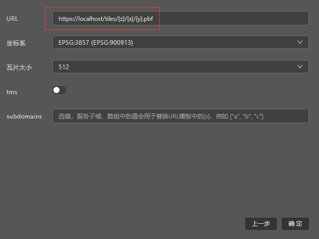

# HTTPS与跨域反向代理

因为Designer是https协议服务，浏览器不允许其直接访问http协议数据，当您的数据源为http协议，Designer创建设计时会出现以下报错：


这时需要您将数据服务配置为https服务或者创建一个https反向代理，以https协议供Designer访问。

如果您有数据服务的配置权限，可以自行搜索相关教程将服务配置为https协议。

当您没有数据服务的配置权限，您可以在本机通过以下方式简单创建一个https反向代理:

（假设您的数据服务和端口为 localhost:8080）

## caddy

[caddy](https://caddyserver.com/)是默认使用https协议的现代http服务软件，使用caddy配置https反向代理只需要以下几步：

* [下载caddy](https://caddyserver.com/download)
* 在caddy文件目录下，创建一个名为 Caddyfile 的无扩展名文本文件
* 往该文本文件中写入反向代理配置：
```
:443 {
    reverse_proxy /* http://localhost:8080 {
        header_up Host {http.reverse_proxy.upstream.hostport}
        header_down Access-Control-Allow-Headers *
        header_down Access-Control-Allow-Origin *
    }
}
```
* 在该目录下用命令行运行 ```caddy run```

## 跨域访问

上面的https反向代理配置在响应头中添加了CORS，以允许跨域访问。

## 在Designer中使用

无论您使用上面哪种方式，成功运行https反向代理后，原本的http url

`http://localhost:8080/tiles/{z}/{x}/{y}.pbf`

就能用下面的https url

`https://localhost/tiles/{z}/{x}/{y}.pbf`

在Designer中访问数据。


