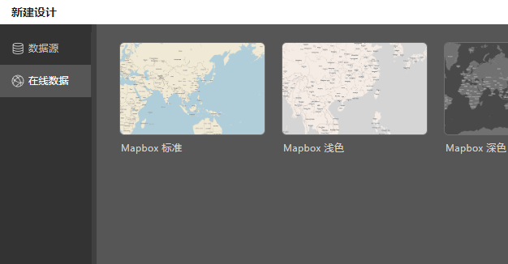
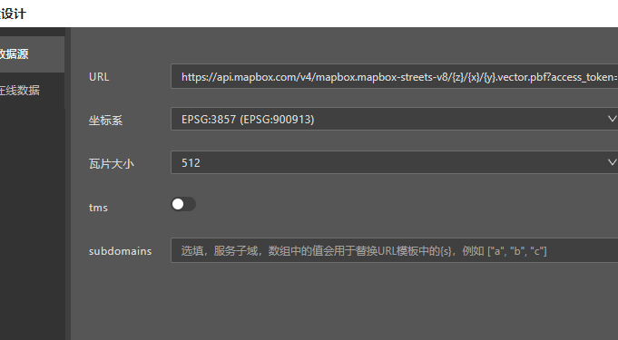
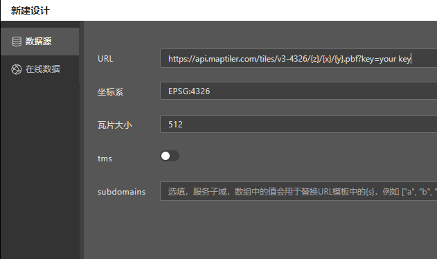

# 互联网地图服务

目前全世界常用的矢量瓦片底图服务包括：

- [mapbox](https://mapbox.com)
- [maptiler](https://maptiler.com)
- [open map tiles](https://openmaptiles.org/)
- [nextzen](https://www.nextzen.org/)

Designer 预置了其中一些服务的设计模板，除此之外您仍然通过[自定义数据源](./datasource)方式连接它们。

## 预置模板

通过 Designer 的预置模板，只需要选择您需要的底图风格模板，并填入服务 token 即可。

预置模板同时内置了图层定义，不需要您再手动创建图层。

> [!NOTE]
> Designer 未来会提供更多互联网地图商的支持。

## 通过自定义数据源

您也可以通过[自定义数据源](./datasource)的向导来连接这些数据服务。

- 连接 mapbox 服务

只需要在面板中填入带有 mapbox 服务 token 的 URL 模板，就能连接 mapbox 数据服务。

- 连接 maptiler 的 4326 投影数据

同理，连接 maptiler 的 4326 投影瓦片，除了在 url 中带入 token，投影选择 4326 即可。

