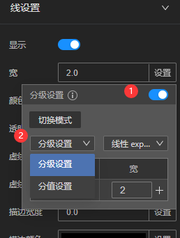
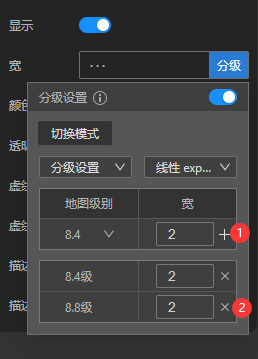
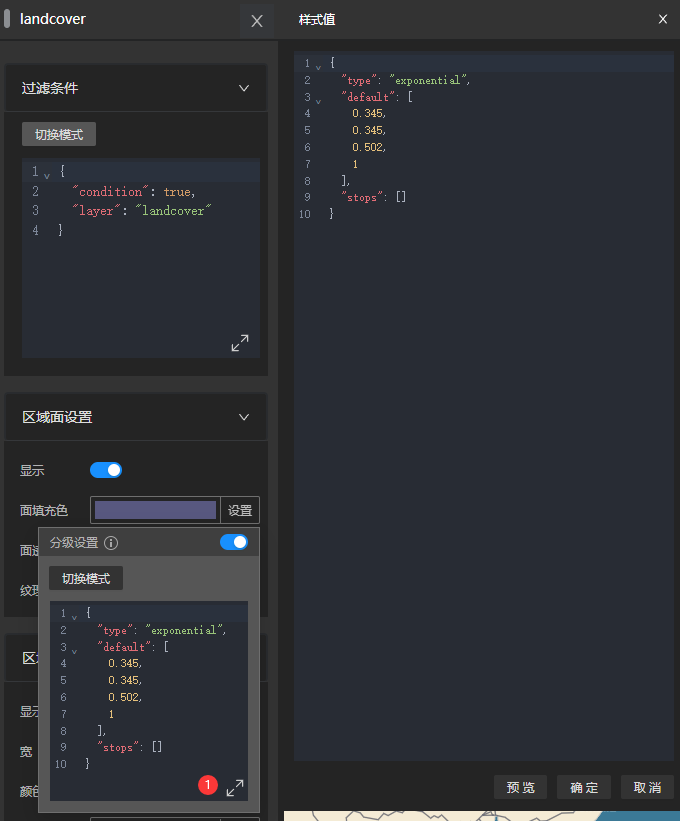

# 分级或分值设置

分级或分值设置通过 [function-type 表达式](/guide/sdk/function-type)在不同情况设置不同的样式。

例如以下几种常见需求：

* 为道路图层在不同级别设置不同的线宽
* 国家名称在不同级别设置不同的大小

## 交互模式

如果某个样式属性支持function-type（分级设置），默认采用交互模式来进行设置。

* 点击①处radio按钮打开分级设置
* 在②处下拉框选择模式
    * 分级模式是根据不同的zoom设置不同样式
    * 分值模式是根据数据不同的属性值设置不同的样式
* 选择模式后，在下面的表格中设置不同值（表格左栏）下的样式值（表格右栏）。
* 点击表格中①处 + 按钮，可以增加新值
    * 分级模式下会读取地图当前zoom级别作为左栏的值，如果该级别已经设置过样式则无法添加，需要通过滚轮改变地图缩放级别后添加
* 您可以随时通过表格中②处的 X 按钮删除设定的值

## 代码模式

有时单纯的交互模式无法满足您的需求，可以点击面板上的切换模式切换到代码模式。

代码模式仅支持function-type表达式。

点击①处按钮打开编辑器，输入function-type代码。

您也可以通过预览按钮预览当前的效果，通过确定按钮应用修改或取消按钮来取消修改。
