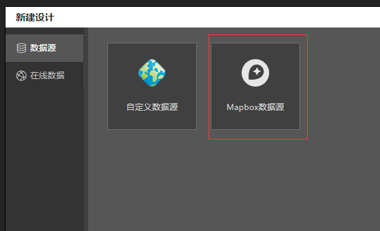
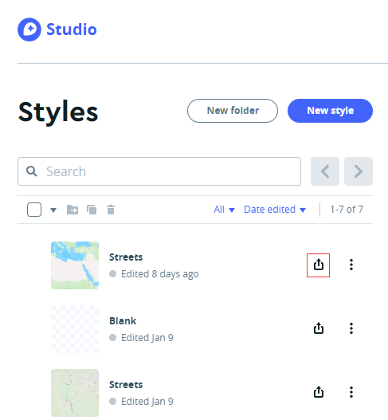
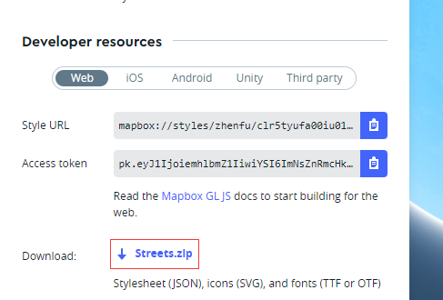
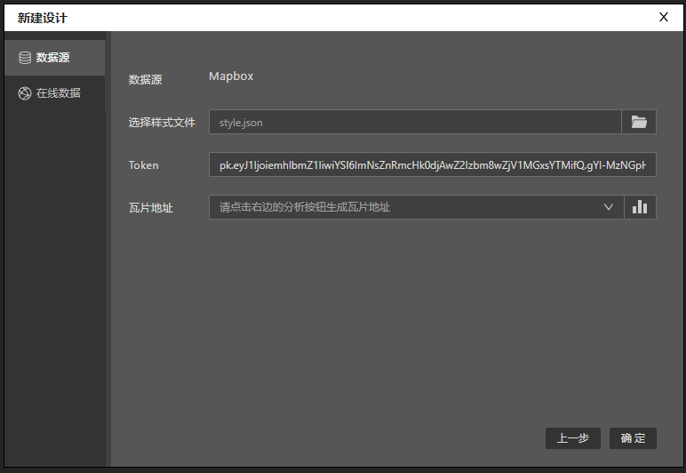
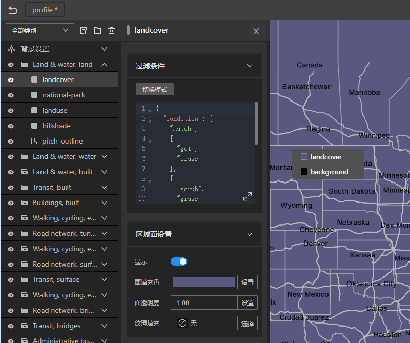

# mapbox数据源

如果您已经拥有[mapbox studio](https://studio.mapbox.com)导出的样式文件，可以通过导入样式文件，向导会自动解析出样式文件中的服务地址与图层配置。

## 下载mapbox样式文件
您可以在 mapbox studio 首页导出样式文件。

* 首先点击需要导出的样式右边的分享按钮。

* 在弹出的面板中，点击下载最下方download处的zip包即可。

## 连接数据源

### 样式文件
解压mapbox样式文件，点击选择样式文件选项右边的文件选择按钮，选择解压文件中的 style.json。

### Token
如果数据服务需要token（mapbox瓦片服务的token规则），则在Token选项中填入您的服务token。

### 瓦片地址
点击瓦片地址右边的按钮，解析样式文件中的瓦片地址，并选择您需要连接的瓦片地址，当然您可以随时修改瓦片地址

### 最后一步

一切准备就绪后，点击确定，Designer会解析样式文件中的图层信息，生成图层列表。

