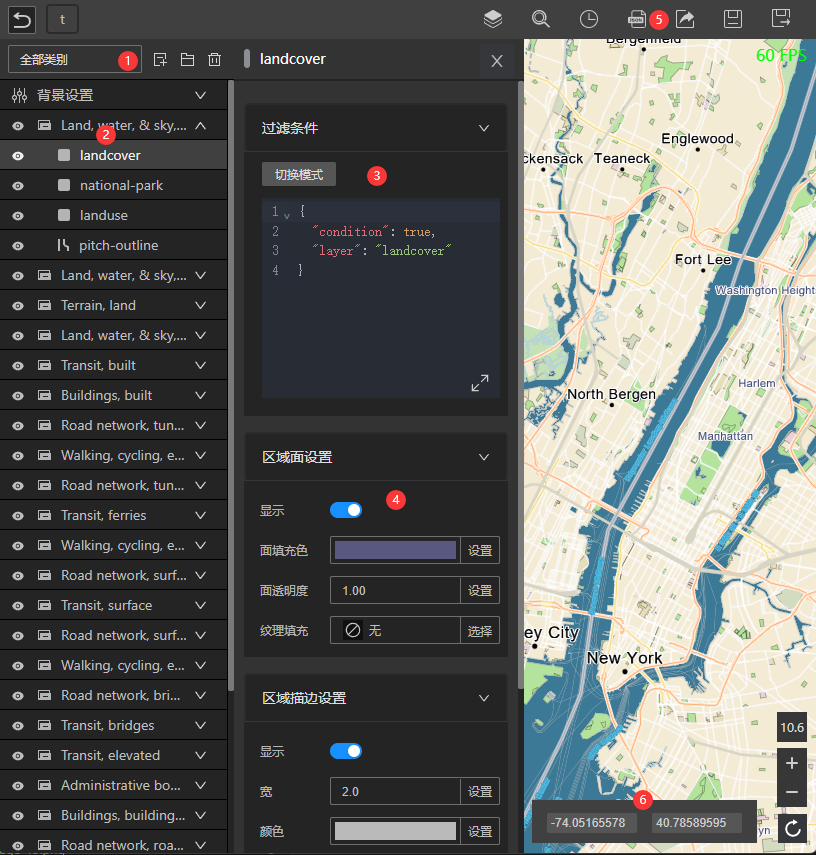

# 界面说明

Designer的主界面如下：

各部分的说明如下：

## 1. 图层功能栏

包含按照类别过滤图层，添加图层，添加图层组和删除图层的功能按钮

## 2. 图层列表

列出当前设计中的所有图层，您也可以给图层分组。

## 3. 图层过滤条件

图层过滤条件的修改面板，有两种模式：`交互模式`和`代码模式`，通过切换模式按钮切换。

### 交互模式

交互模式是[feature-filter](/guide/sdk/feature-filter)表达式的交互式编辑模式。

点击下拉框右边的 + 按钮即可添加新的条件项，依次添加属性的过滤条件后，根据需要通过下拉框选择条件的组合模式。

### 代码模式

代码模式支持 [feature-filter](/guide/sdk/feature-filter) 表达式和 [mapbox-style-spec](https://docs.mapbox.com/style-spec/guides/)表达式。

切换到代码模式后，点击扩大按钮编辑代码。

## 4. 图层样式面板

在这里调整图层的样式，不同图形类型的图层有不同的样式选项。

## 5. 工具栏

包含了一些常用工具，包括图层面板，数据查询等辅助工具，历史记录工具，样式导出工具，以及设计的保存和另存为功能。

## 6. 地图控件

包含了地图中心点和级别的操作控件，您可以修改中心点坐标来改变地图的位置。

