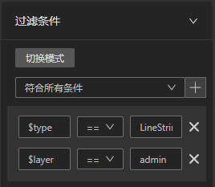
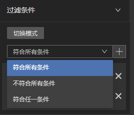
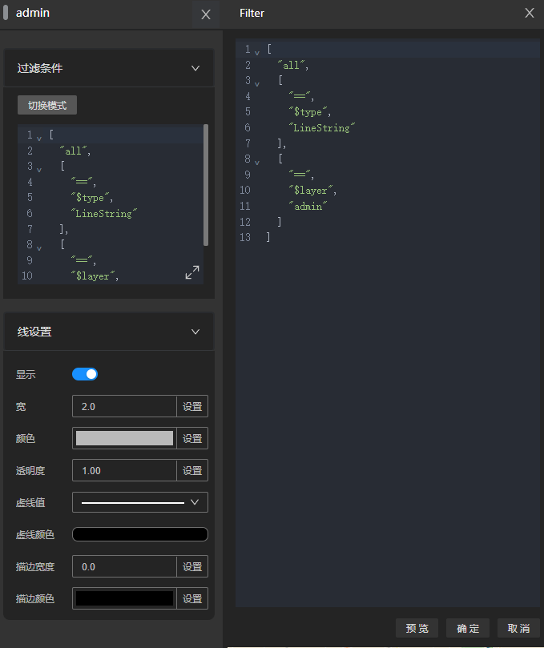

# 修改图层过滤条件

图层过滤条件面板有两个编辑模式，交互模式和代码模式

## 交互模式

交互模式是[feature-filter](/guide/sdk/feature-filter)表达式的交互式编辑模式。

点击下拉框右边的 + 按钮即可添加新的条件项。

添加属性的过滤条件后，可以根据需要通过下拉框选择条件的组合模式

### 代码模式

代码模式支持 [feature-filter](/guide/sdk/feature-filter) 表达式和 [mapbox-style-spec](https://docs.mapbox.com/style-spec/guides/)表达式。

切换到代码模式后，点击扩大按钮编辑代码。

编辑过程中，可以点击预览按钮预览效果，可以通过确定按钮应用修改或取消按钮取消这次修改。
