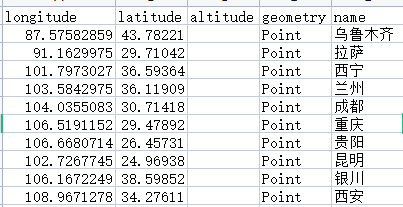

MapTalks IDE 是通过一个叫`GeoJSONVectorTileLayer`的程序接口实现数据文件的导入的。

如名所示，`GeoJSONVectorTileLayer`仅支持[GeoJSON数据格式](https://geojson.org)，但IDE通过转换程序，对丰富的数据格式提供了支持。


## GeoJSON格式

GeoJSON是一种基于JSON的地理空间数据交换格式，它定义了几种类型JSON对象以及它们组合在一起的方法，以表示有关地理要素、属性和它们的空间范围的数据。

<!-- [i18n]其他语言版本里需要替换为维基百科的相应语言链接 -->

(以上引用自[维基百科](https://zh.wikipedia.org/wiki/GeoJSON))

因为GeoJSON基于web端的通用数据格式JSON格式，因此GeoJSON对于前端程序和人眼阅读都非常友好，从而成为web端GIS系统中应用最为广泛的数据格式。

## 支持的其他格式

IDE通过转换程序，能将以下格式转换为GeoJSON后导入到地图上。

* CSV：用逗号(,)分隔的电子表格(Excel)数据格式
* GPX：是一种基于XML的通用GPS数据格式
* KML：是一种基于XML的地理数据存储格式，OGC标准
* WKT：全称Well-known text，是一种文本标记语言，用于表示矢量几何对象、空间参照系统及空间参照系统之间的转换
* TopoJSON：是GeoJSON的扩展，用于将地理数据结构编码为共享拓扑。
* Encoded Polyline：是一种谷歌开发的[坐标压缩数据格式](https://developers.google.com/maps/documentation/utilities/polylinealgorithm)。 


## CSV的导入

因为CSV表格数据中没有固定的地理信息属性列，所以导入CSV时，需要人工指定哪一列是精度，哪一列是纬度。

这也意味着CSV格式目前只支持点类型(Point)的数据导入。


## Shapefile的导入

<!-- [i18n]其他语言版本里需要替换为维基百科和英文的导入教程 -->
[Shapefile格式](https://baike.baidu.com/item/shapefile%E6%96%87%E4%BB%B6/11041662?fr=aladdin)是ESRI公司开发的一种常用地理信息数据存储格式，常用于ArcGIS等流行软件。

因为Shapefile转换为GeoJSON的程序成熟度和稳定性的原因，IDE目前暂时不支持直接导入Shapefile格式。 如果您想导入Shapefile数据，推荐使用开源地理信息软件[QGIS](https://www.qgis.org/)将shapefile转换为GeoJSON数据格式后再导入。

<!-- [i18n]其他语言版本里需要替换为相应语言的导入教程 -->
具体的转换教程请参考下面[这篇教程](http://events.jianshu.io/p/6b540e7f446b)。

## 常见格式介绍
### GeoJSON

GeoJSON 是一种基于JSON的地理空间数据交换格式，它定义了几种类型JSON对象以及它们组合在一起的方法，以表示有关地理要素、属性和它们的空间范围的数据。
```
{
  "type": "Feature",
  "geometry": {
    "type": "Point",
    "coordinates": [125.6, 10.1]
  },
  "properties": {
    "name": "Dinagat Islands"
  }
}
```
GeoJSON支持以下几何类型：Point，LineString， Polygon，MultiPoint，MultiLineString，和MultiPolygon。具有附加属性的几何对象是Feature对象。特征集由FeatureCollection对象包含。

2015 年，互联网工程任务组 (IETF) 与原始规范作者一起组成了GeoJSON WG来标准化 GeoJSON。 RFC 7946于 2016 年 8 月发布，是 GeoJSON 格式的新标准规范，取代了 2008 GeoJSON 规范。

这种格式在IDE中，可以通过GeoJSON图层导入，也可以在点线面中通过批量数据来导入。

官方网站: https://geojson.org

### CSV

csv是一堆文本数据,如下，您可以很方便的定义和编辑它，在IDE中，如果没有经纬度字段，需要您自己指定，才能做解析。

```
long,latitude,altitude,geometry,name
87.57582859,43.78221165,,Point,乌鲁木齐
91.1629975,29.71042046,,Point,拉萨
```

xlsx是office的表格数据,核心结构是 XML 类型的结构。示例如下。



### GPX

GPX（GPS eXchange Format，GPS交换格式）是一个XML格式，为应用软件设计的通用GPS数据格式。

它可以用来描述路点、轨迹、路程。这个格式是免费的，可以在不需要付任何许可费用的前提下使用。它的标签保存位置，海拔和时间，可以用来在不同的GPS设备和软件之间交换数据。如查看轨迹、在照片的exif数据中嵌入地理数据。

下面这个GPX文件（局部）是由Garmin Oregon 400t手持GPS设备产生，这个文件展示了GPX格式的功能。

```xml
<?xml version="1.0" encoding="UTF-8" standalone="no" ?>

<gpx xmlns="http://www.topografix.com/GPX/1/1" xmlns:gpxx="http://www.garmin.com/xmlschemas/GpxExtensions/v3" xmlns:gpxtpx="http://www.garmin.com/xmlschemas/TrackPointExtension/v1" creator="Oregon 400t" version="1.1" xmlns:xsi="http://www.w3.org/2001/XMLSchema-instance" xsi:schemaLocation="http://www.topografix.com/GPX/1/1 http://www.topografix.com/GPX/1/1/gpx.xsd http://www.garmin.com/xmlschemas/GpxExtensions/v3 http://www.garmin.com/xmlschemas/GpxExtensionsv3.xsd http://www.garmin.com/xmlschemas/TrackPointExtension/v1 http://www.garmin.com/xmlschemas/TrackPointExtensionv1.xsd">
  <metadata>
    <link href="http://www.garmin.com">
      <text>Garmin International</text>
    </link>
    <time>2009-10-17T22:58:43Z</time>
  </metadata>
  <trk>
    <name>Example GPX Document</name>
    <trkseg>
      <trkpt lat="47.644548" lon="-122.326897">
        <ele>4.46</ele>
        <time>2009-10-17T18:37:26Z</time>
      </trkpt>
      <trkpt lat="47.644548" lon="-122.326897">
        <ele>4.94</ele>
        <time>2009-10-17T18:37:31Z</time>
      </trkpt>
      <trkpt lat="47.644548" lon="-122.326897">
        <ele>6.87</ele>
        <time>2009-10-17T18:37:34Z</time>
      </trkpt>
    </trkseg>
  </trk>
</gpx>
```
以上内容摘抄自wiki。


### KML

Keyhole 标记语言 (KML) 是一种基于 XML 的格式，用于存储地理数据和相关内容，是一种开放地理空间联盟 (OGC) 标准。KML 格式便于在 Internet 上发布并可通过 Google 地球和 ArcGIS Explorer 等许多免费应用程序进行查看，因此常用于与非 GIS 用户共享地理数据。KML 文件要么以 .kml 为扩展名，要么以 .kmz（表示压缩的 KML 文件）为扩展名。

KML 可以由要素和栅格元素组成，这些元素包括点、线、面和影像，以及图形、图片、属性和 HTML 等相关内容。尽管通常将 ArcGIS 中的数据集视为独立的同类元素（例如，点要素类只能包含点，栅格只能包含像元或像素，而不能包含要素），但单个 KML 文件却可以包含不同类型的要素，并可包含影像。

局部文件如下。
```xml
<?xml version="1.0" encoding="UTF-8"?>
<kml xmlns="http://www.opengis.net/kml/2.2">
  <Document>
    <name>KML Samples</name>
    <open>1</open>
    <description>Unleash your creativity with the help of these examples!</description>
    <Style id="downArrowIcon">
      <IconStyle>
        <Icon>
          <href>http://maps.google.com/mapfiles/kml/pal4/icon28.png</href>
        </Icon>
      </IconStyle>
    </Style>
    <Style id="globeIcon">
      <IconStyle>
        <Icon>
          <href>http://maps.google.com/mapfiles/kml/pal3/icon19.png</href>
        </Icon>
      </IconStyle>
      <LineStyle>
        <width>2</width>
      </LineStyle>
    </Style>
    ...
```


### WKT

WKT(Well-known text)是一种文本标记语言，用于表示矢量几何对象、空间参照系统及空间参照系统之间的转换。它的二进制表示方式，亦即WKB(well-known binary)则胜于在传输和在数据库中存储相同的信息。该格式由开放地理空间联盟(OGC)制定。
```wkt
POINT(6 10)
LINESTRING(3 4,10 50,20 25)
POLYGON((1 1,5 1,5 5,1 5,1 1),(2 2,2 3,3 3,3 2,2 2))
MULTIPOINT(3.5 5.6, 4.8 10.5)
MULTILINESTRING((3 4,10 50,20 25),(-5 -8,-10 -8,-15 -4))
MULTIPOLYGON(((1 1,5 1,5 5,1 5,1 1),(2 2,2 3,3 3,3 2,2 2)),((6 3,9 2,9 4,6 3)))
GEOMETRYCOLLECTION(POINT(4 6),LINESTRING(4 6,7 10))
POINT ZM (1 1 5 60)
POINT M (1 1 80)
```

### OSM

OSM使用的资料格式是地形数据结构，当中由四个核心的元素（也称为原始资料）。

节点（node）：存储经纬度，表示位置，但不存储节点在地图上的实际大小，比如说一个景点或者山峰，或一间商店或餐厅，或是做为路径的一部分。节点可依附于路径与关系。

路径（way）：有序排列的节点，以折线的形式呈现，也能循环回起始节点形成封闭路径，可以循环路径或以多边形区域的方式呈现。这类原始资料可用于呈为线性资料，例如街道、河流等，或一个多边形区域，例如农田、公园、停车场、建筑物、校园或者是湖泊、森林。路径必须有节点才能显示于地图上，可依附于关系，路径资料可计算出长度、或多边形的面积、周长。

关系（relation）：有排序的节点、路径和关系（三类原始资料在这里统称“成员”），在这里每个成员选择性拥有一个"角色"（字符串），以决定该成员于此关系中的性质。关系是用来表示各个原始资料（节点、路径和关系）的关系，例如道路的转弯限制，由不同路径所组成的边界，一条国道、省道或铁路路线，或者一个区域中中间空缺区域（例如被环形建筑物包围的中庭，或水体中的小岛）的多重多边形，这时"角色"字符串就能用来形容它们之间的关系。

标签（tag）：键值对（key-value pairs，键值都是字符串），用来存储地图上对象的元数据（对象的类型，名字和物理特性），赋予OSM资料其意义，而能表示现实世界中存在的某件事物，与有关其事物的信息。标签无法独立存在，它们必须依附在一个已存在的对象，也就是节点，路径或关系。地图中对象映射的关系（本体）和标签在OSM的wiki上有比较详细的介绍，用法为鍵=值；key=value。一个原始资料称为一个对象，每个对象的同一个键，只能设置一个值。例如建筑物是building=yes，至于住宅区街道，则为highway=residential，这是OSM中最频繁被使用的标签。


### TopoJSON
	
TopoJSON 是一种JSON格式，用于将地理数据结构编码为共享拓扑。TopoJSON 拓扑表示一个或多个共享称为arcs的位置序列的几何。TopoJSON 作为GeoJSON的扩展，支持多种几何类型：Point、LineString、Polygon、MultiPoint、MultiLineString、MultiPolygon 和 GeometryCollection。TopoJSON 中的几何图形可能包含其他属性来编码非几何数据。

官方网站： https://github.com/topojson/topojson

### Encoded Polyline

Encoded Polyline是一种谷歌开发的[坐标压缩数据格式]，是一个点列表，在连续点之间绘制线段。 

官方网站： https://developers.google.com/maps/documentation/utilities/polylinealgorithm
